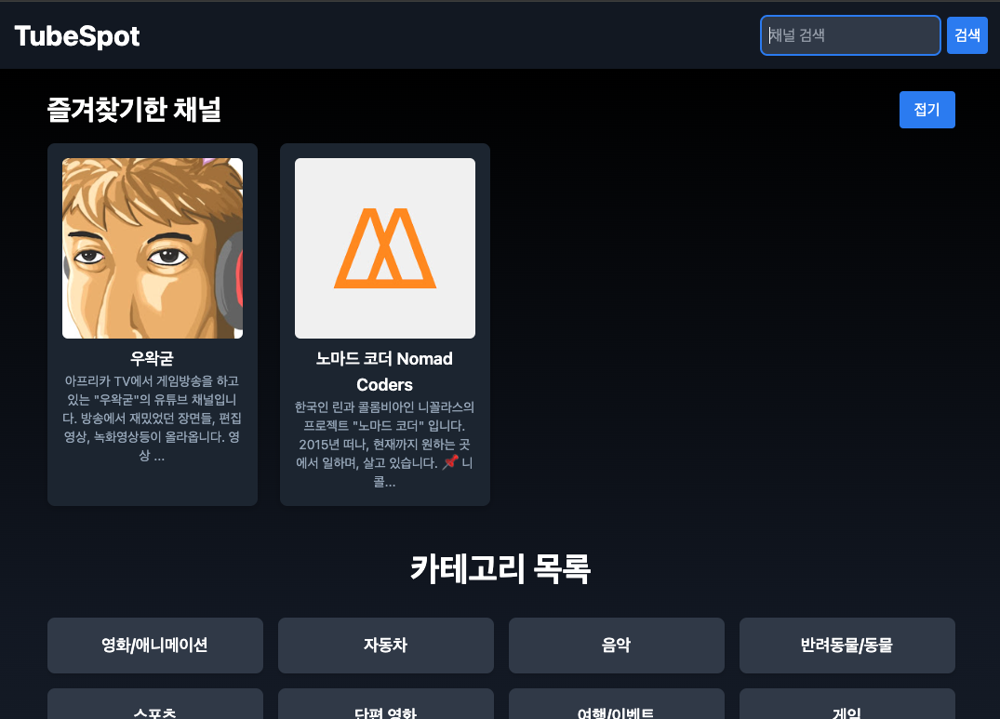

# TubeSpot 🎥

**TubeSpot**은 **YouTube API**를 사용하여 유튜브 채널, 영상 및 관련 정보를 조회하고 관리할 수 있는 웹 애플리케이션입니다.  
로그인 없이 Cookie를 이용하여 **유튜브 채널 검색, 카테고리 목록 조회, 즐겨찾기 기능** 등을 제공하며, 사용자에게 편리한 영상 탐색 경험을 제공합니다.  
향후 **주변 지인들의 피드백을 기반으로** 추가적인 수정과 기능 업데이트가 예정되어 있습니다.

---

## 🖼️ 홈 화면


---

## 🛠️ 기술 스택

### **Backend:**
- Node.js 16+
- Express.js
- YouTube Data API v3

### **Frontend:**
- React
- TypeScript
- Tailwind CSS

---

## 🎯 주요 기능

### **✅ 유튜브 카테고리 관리:**
- YouTube의 카테고리별 콘텐츠 목록을 조회할 수 있습니다.

### **🔍 채널 검색:**
- 사용자가 입력한 키워드에 맞는 유튜브 채널을 검색할 수 있습니다.

### **📺 채널 세부 정보 및 영상:**
- 각 채널의 세부 정보를 조회하고, 업로드된 영상을 확인할 수 있습니다.

### **⭐ 즐겨찾기 기능:**
- 사용자는 좋아하는 채널을 즐겨찾기에 추가할 수 있으며, 쿠키를 통해 즐겨찾기 목록을 저장합니다.
- 홈 화면에서 즐겨찾기 채널을 상단에서 빠르게 확인할 수 있습니다.

---

## 🔑 환경 변수 설정 (.env)

프로젝트의 원활한 실행을 위해 다음과 같은 환경 변수를 `.env` 파일에 설정해야 합니다:
```
YOUTUBE_API_KEY=YOUR_YOUTUBE_API_KEY
```

YouTube API Key는 [Google Cloud Console](https://console.cloud.google.com/)에서 발급받을 수 있습니다.

---

## 📝 프로젝트 의도

이 프로젝트는 **유튜브 정보를 보다 쉽게 획득**하고, 사용자에게 **편리한 유튜브 탐색** 경험을 제공하기 위해 시작되었습니다.  
주변 지인들의 피드백을 받아 기능을 개선하고, 추가 기능 업데이트가 계속될 예정입니다.